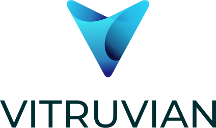

 
Vitruvian is a next generation web framework written in .net core that allows you to deploy and manage microsites in an easy and flexible manner through a common web gateway behind a singular address.